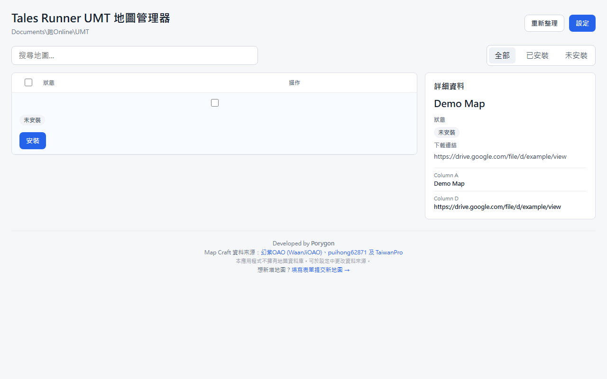

# Tales Runner UMT Map Manager

<p align="center">
  
</p>

테일즈런너 (跑 Online) 플레이어 제작 맵(UMT)을 관리하는 데스크톱 애플리케이션입니다.


## Screenshot

<p align="center">
  
</p>

🌐 **Language**: [繁體中文](README.md) | [English](README_EN.md) | [한국어](README_KR.md)

## 기능

- 📋 **맵 목록** — Google Sheets에서 맵 데이터베이스를 자동으로 불러와 사용 가능한 모든 UMT 맵을 표시
- 🔍 **검색 및 필터** — 키워드로 맵 검색, 설치됨/미설치 상태 필터
- 📥 **원클릭 설치** — Google Drive에서 `.upk` 맵 파일을 직접 다운로드하여 지정된 폴더에 설치
- 🔄 **비활성화/활성화** — 맵을 삭제하지 않고 비활성화(`_deactivated` 폴더로 이동), 언제든 활성화 가능
- 🗑️ **안전한 제거** — 설치 기록을 기반으로 맵을 안전하게 삭제, 다른 파일에 영향 없음
- 📊 **사용자 정의 열** — 테이블에 표시할 열과 순서를 자유롭게 선택 (표시 이름, 맵 ID, 분류, 제작자 등)
- 🖼️ **이미지 미리보기 및 슬라이드쇼** — 상세 패널 위에 맵 이미지 캐러셀, 클릭 시 확대 지원
- 🎬 **YouTube 영상 임베드** — 맵 소개 영상이 슬라이드쇼에 직접 임베드, 앱을 떠날 필요 없음
- 🌐 **다국어** — English, 繁體中文(홍콩/대만), 한국어 지원

## 설치

최신 설치 파일을 다운로드하세요:

- **Windows**: `Tales Runner UMT Map Manager_x.x.x_x64-setup.exe` (NSIS) 또는 `.msi`

## 사용 방법

### 1. 애플리케이션 실행

설치 후 앱을 열면 Google Sheets에서 맵 목록을 자동으로 불러옵니다.

### 2. 맵 탐색

- 왼쪽 테이블에 모든 사용 가능한 맵이 표시됩니다 (기본: "표시 이름" 및 "맵 ID" 열)
- 상단 검색창으로 키워드 필터링
- `전체` / `설치됨` / `미설치` 버튼으로 상태 필터링
- 맵을 클릭하면 오른쪽 패널에 상세 정보 표시

### 3. 맵 설치

1. 설치하려는 맵을 찾습니다 (상태: "미설치")
2. `설치` 버튼을 클릭합니다
3. Google Drive에서 `.upk` 파일을 자동으로 다운로드합니다
4. 다운로드 완료 후 맵 폴더에 자동 복사됩니다

### 4. 맵 비활성화 / 활성화

- **비활성화**: 설치된 맵의 `비활성화` 클릭 — 파일이 `_deactivated` 하위 폴더로 이동 (게임에서 로드되지 않음)
- **활성화**: 비활성화된 맵의 `활성화` 클릭 — 파일이 원래 위치로 이동

### 5. 맵 제거

1. 설치되거나 감지된 맵을 찾습니다
2. `제거` 버튼을 클릭합니다
3. 맵 파일이 안전하게 삭제됩니다

### 6. 설정

우측 상단 `설정` 버튼으로 조정:

| 설정 | 설명 |
|------|------|
| **설치 폴더** | 맵 파일 저장 위치, 기본값: `Documents\跑Online\UMT` |
| **Google Sheets URL** | 맵 데이터베이스 소스, 기본값: 공식 "Database for html" 탭 |
| **언어** | 인터페이스 언어 |
| **표시 열** | 테이블에 표시할 열과 순서 선택 (▲▼ 순서 변경, ✕ 제거, + 추가) |

### 맵 상태 설명

| 상태 | 설명 | 작업 |
|------|------|------|
| **미설치** | 아직 설치되지 않은 맵 | `설치` |
| **설치됨** | 이 앱으로 설치된 맵 | `비활성화` `제거` |
| **감지됨** | 폴더에서 발견된 맵 (이 앱으로 설치하지 않음) | `비활성화` `제거` |
| **비활성화됨** | 비활성화된 맵 (`_deactivated` 폴더에 파일 존재) | `활성화` |

## 기술 스택

- **프론트엔드**: React + TypeScript + Vite
- **백엔드**: Rust (Tauri v2)
- **데이터 소스**: Google Sheets CSV Export
- **다운로드**: Google Drive 직접 다운로드 (스트리밍 진행률 표시)
- **설치 파일**: NSIS / MSI (Windows)

## 데이터 소스

맵 데이터베이스는 다음 멤버들이 공동으로 구축하고 관리합니다:

- **幻紫OAO** (읽기: 왕지OAO / หว่างจี๋OAO / WaanJiOAO)
- **puihong62871**
- **TaiwanPro**

앱 개발: **Porygon**

> ⚠️ 이 앱은 맵 데이터베이스를 소유하지 않습니다. 맵 데이터는 위 멤버 및 각 제작자에게 귀속됩니다.
> 사용자는 **설정 → Google Sheets URL**에서 데이터 소스를 변경할 수 있습니다.

소스 문서: [Google Docs](https://docs.google.com/document/d/1A58tWn9h94VHtBmlC5YpmSG1ve42pg4zH4vHZghJiuk/edit?tab=t.0)

## 기여하기

기여를 환영합니다! 다음 워크플로우를 따라주세요:

1. Repo를 Fork합니다
2. 브랜치 생성: `git checkout -b feature/your-feature`
3. 변경사항 커밋: `git commit -m 'Add some feature'`
4. 브랜치에 푸시: `git push origin feature/your-feature`
5. Pull Request 열기

> ⚠️ **모든 PR은 master 브랜치에 병합되기 전에 승인이 필요합니다.**

### 새 맵 제출

데이터베이스에 맵을 추가하고 싶으신가요? 이 양식을 작성해주세요:

👉 [새 맵 제출](https://docs.google.com/forms/d/e/1FAIpQLScLfPEDOoMfQj9bKD6E0JB-YNDS-HN2YCmUu323kz312acwFQ/viewform)

## 개발

```bash
# 의존성 설치
npm install

# 개발 모드
npm run tauri dev

# Windows 설치 파일 빌드
npm run tauri build
```

## 라이선스

개인 및 커뮤니티 사용을 위한 것입니다. 맵 데이터는 각 제작자에게 귀속됩니다.
